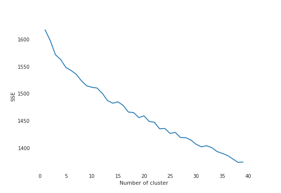

# HER
 Hackintine Engine for Recommendation
 
 ## Team Details

- Team Name: deadmau5
- Members: 1
- Member Name: [Sunny Dhoke](https://linkedin.com/in/sunn-e)
- Email: sunnydhoke22@gmail.com
- GitHub: [sunn-e](https://github.com/sunn-e)
- Project name: HER ( Hackintine Engine for Recommendation )
- Project name inspiration : [HER](https://www.imdb.com/title/tt1798709/)
## Problem Statement

### Build a recommendation engine

- Given Precisely’s dataset of opportunities, cluster them based on relevant semantic meanings [ 54 points ]
Example: If there is an opportunity for computer science students and another opportunity related to Machine Learning, they should be clustered closer together, when compared with a Social Sciences opportunity

-  Given a dataset of user preferences, recommend opportunities from the opportunity dataset [ 54 points ]

# HER : Hackintine Engine for Recommendation

HER(she|?) is a recommendation engine based on unsupervised learning approach of machine learning. 

## Let the story begin

Okay, so I started with getting the data from awesome team of Precisely. The data was inititally in pdf and excel format. There were 3 files. 
- user agreement
- user data
- item data

Notice: The user agreement is for me and use of data, the legeal stuff. I read it and state that this data is only for educational purpose. Me nor precisely is responsible for any misuse.

Well, that being said, let's start, I first converted user data pdf and item data excel file to csv format.

This will help with pandas Though pandas can support excel, I just prefer everything to be consistent in a system. The data is inside data/ folder. 

I loaded the data using pandas.Initially I want to only work with item data as once once we decide what has to be recommended can be recommended to user easily since we have a user's dicscipline data.


Then I did some EDA to find what are the cardinalities and how the data actually looks like. 

The data is high in cardinality in most columns. This toughens our situation as unsupervised learning needs us to define few parameters.

For some experiment, I find out that we can guess what can be k - value. 
```
Humanities and Social Sciences	
2328
All	
992
Management	
 
403
Engineering and Technology	
 
362
Humanities and social sciences	
 
362
Other values (101)	
1036 

```
As you can see, we have 5+1 rough categories. For the simplicity, I made a k-means model to train with k =6, so as to get properly clustered "clusters".

But, due to again high cardinality, we see that there are way too many repeatations in all cluters. 

I saved this model under models format `k-5+1.sav`
Solution to overcome that? 
Haha.. GO BRUTEFORCE. I tried for all values of K from 1 to 40. 
Then plotted the graph and checked where the graph slope get's flat.



Lucky for me, it got flat before it hit k =40. Otherwise I would have to increase k to 50 and keep hoping for slope to get parallel to x-axis.

Neverthless, I chose k =38 as it was quite evident from my experiment for this value of k, I am getting pretty good indicators.

Also, I want to avoid 40 as otherwise it's just overfitting. Overfitting is bad, we need generalised approach. :p

Stay tuned for more. 
